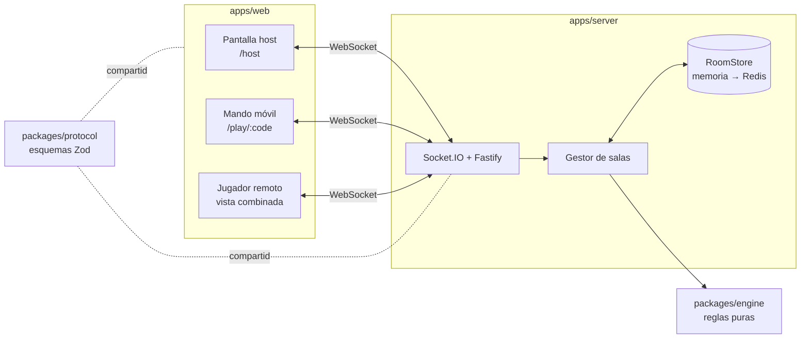

# Arquitectura — proyecto `hexa`

## Contexto y objetivos

Juego de mesa por turnos con información oculta (la mano de cada jugador) e información pública (el tablero). Requisitos que guían el diseño:

1. **Autoridad central:** sin trampas posibles desde el cliente.
2. **Clientes ligeros:** navegador, sin instalación; móviles que se bloquean y reconectan.
3. **Reproducibilidad:** cualquier partida se puede reconstruir para depurar.
4. **Escalabilidad progresiva:** empezar con una sola instancia y poder crecer sin reescribir.
5. **Temática intercambiable:** las reglas no conocen nombres, colores ni arte.

## Visión general



## Estructura del repositorio

```
hexa/
├─ CLAUDE.md                 instrucciones de trabajo
├─ ROADMAP.md                fases, tareas y estado
├─ apps/
│  ├─ server/                Node: Fastify + Socket.IO
│  │  └─ src/
│  │     ├─ net/             conexión, validación de mensajes, rate limit
│  │     ├─ rooms/           ciclo de vida de salas, lobby, códigos
│  │     ├─ sessions/        tokens de asiento y reconexión
│  │     ├─ store/           RoomStore (memoria, Redis, escritura diferida)
│  │     └─ bots/            bots que juegan en el servidor
│  └─ web/                   Vite + React
│     └─ src/
│        ├─ net/             cliente Socket.IO tipado
│        ├─ board/           render SVG del tablero (compartido)
│        ├─ host/            pantalla principal
│        ├─ controller/      mando móvil
│        ├─ remote/          vista combinada para jugar a distancia
│        └─ i18n/            textos es / en
├─ packages/
│  ├─ engine/                reglas puras, sin dependencias de plataforma
│  │  └─ src/
│  │     ├─ board/           coordenadas hex, grafo, mapas, generador
│  │     ├─ state/           tipos del estado y creación de partida
│  │     ├─ actions/         un archivo por acción
│  │     ├─ rules/           validaciones reutilizables
│  │     ├─ scoring/         puntos, ejército, camino más largo
│  │     ├─ rng/             RNG con semilla
│  │     ├─ views/           getPlayerView, legalActions
│  │     └─ sim/             bots y simulador de partidas
│  ├─ protocol/              esquemas Zod y tipos de mensajes
│  └─ theme/                 nombres, colores e iconos de la temática
├─ assets/                   arte original + LICENSES.md
├─ e2e/                      Playwright
└─ docs/
   ├─ ARCHITECTURE.md
   ├─ RULES.md
   ├─ devices.md
   └─ decisions/
```

Regla de dependencias: `engine` no depende de nadie; `protocol` depende de `engine` (tipos); `server` y `web` dependen de ambos; `theme` solo lo usa `web`.

## El motor (`packages/engine`)

### API pública

```ts
createGame(config: GameConfig, seed: string): GameState

applyAction(
  state: GameState,
  playerId: PlayerId,
  action: Action,
): Result<{ state: GameState; events: GameEvent[] }, RuleError>

legalActions(state: GameState, playerId: PlayerId): Action[]

getPlayerView(state: GameState, viewer: PlayerId | 'host' | 'spectator'): PlayerView
```

- `Action` es una unión discriminada (`{ type: 'BUILD_ROAD', edge }`, `{ type: 'ROLL' }`, …).
- `GameEvent` describe lo ocurrido para animaciones y registro (`DICE_ROLLED`, `RESOURCES_PRODUCED`, …).
- `RuleError` es un código (`'NOT_YOUR_TURN'`, `'NOT_ENOUGH_RESOURCES'`, …) que la web traduce por i18n.
- `applyAction` nunca muta el estado recibido.

### Esbozo del estado

```ts
type ResourceId = 'r1' | 'r2' | 'r3' | 'r4' | 'r5'; // nombres reales en theme

interface GameState {
  version: number;
  seed: string;
  rng: RngState;
  config: GameConfig;
  board: Board; // hexágonos, vértices, aristas, puertos
  players: PlayerState[]; // recursos, cartas, piezas restantes
  buildings: Record<VertexId, { owner: PlayerId; kind: 'settlement' | 'city' }>;
  roads: Record<EdgeId, PlayerId>;
  robber: HexId;
  bank: Record<ResourceId, number>;
  devDeck: DevCardId[]; // oculto para todos los clientes
  phase: Phase; // setup | roll | main | discard | robber | ... | ended
  turn: {
    player: PlayerId;
    number: number;
    lastRoll: [number, number] | null;
    devCardPlayed: boolean;
  };
  pendingTrade: TradeOffer | null;
  nextOfferId: number;
  awards: { largestArmy: PlayerId | null; longestRoad: PlayerId | null };
  winner: PlayerId | null;
  log: { player: PlayerId; action: Action }[]; // acciones aplicadas, para reproducir la partida
}
```

El estado es un valor JSON puro: se usa `null` en lugar de campos opcionales (no hay `undefined`, `Map` ni `Set`). El código de referencia está en `packages/engine/src/state/types.ts`.

### Enumerar acciones y vistas

`legalActions` enumera las acciones concretas que el motor aceptaría y las filtra con la misma validación que `applyAction`. Las ofertas de comercio (`OFFER_TRADE`) no se enumeran porque sus parámetros son libres; la vista indica con `canOfferTrade` si el jugador puede proponer una.

El simulador (`pnpm sim`) vive en `packages/engine/src/sim` y su CLI en `scripts/sim.ts`, fuera del motor, para que el motor no toque Node.

### Información oculta

`getPlayerView` devuelve, para cada jugador, su mano completa y de los demás solo totales (nº de cartas de recurso y de desarrollo). El host y los espectadores no ven ninguna mano. El mazo y el estado del RNG no salen nunca del servidor.

## Protocolo (`packages/protocol`)

Mensajes cliente → servidor: `room:create` (con `role: 'player'` crea una sala a distancia sin pantalla principal), `room:join`, `room:leave`, `lobby:update`, `lobby:addBot`, `lobby:removeBot`, `lobby:start`, `game:action`, `game:preview`, `session:resume`.

Mensajes servidor → cliente: `room:state` (lobby), `game:view` (vista personal + `legalActions`), `game:events`, `game:preview` (lo que elige el jugador de turno, efímero), `error`.

Todos los mensajes del cliente llevan `protocolVersion`. El servidor valida cada uno con Zod antes de procesarlo y descarta los inválidos (`UNKNOWN_MESSAGE`, `PROTOCOL_VERSION_MISMATCH`, `INVALID_MESSAGE`).

Las peticiones del cliente reciben una respuesta (ack) `{ ok: true, data } | { ok: false, error }`; `room:create`, `room:join` y `session:resume` devuelven la sesión (`code`, `token`, `role`, `playerId`). Detalles y razones en `docs/decisions/0007-servidor-gestor-de-salas.md`.

## Flujo de una acción

1. El mando envía `game:action` con la acción y su token de asiento.
2. El servidor valida el esquema, identifica jugador y sala.
3. `applyAction` del motor; si falla, `error` solo a ese cliente.
4. Si va bien: se guarda el nuevo estado y la acción en el registro de la sala.
5. Se envía a cada cliente su `game:view` y a todos los `game:events`.

## Persistencia y reproducibilidad

Cada sala guarda `seed + config + lista de acciones`. Como el motor es determinista, reaplicar las acciones reconstruye exactamente la partida. Esto permite reproducir bugs, sobrevivir a reinicios y, más adelante, repeticiones de partidas. Se guarda además una instantánea del estado para no tener que reaplicarlo todo en cada carga.

El gestor mantiene las salas en memoria y las escribe en un `RoomStore` tras cada cambio sin esperar. Con `REDIS_URL` el almacén es `RedisRoomStore` (una clave JSON por sala con caducidad) envuelto en `WriteBehindStore`, que junta las escrituras, reintenta si Redis cae y vuelca lo pendiente al apagar; sin `REDIS_URL` se usa memoria (desarrollo). Detalles en el ADR 0012.

## Plan de escalado

| Etapa | Cuándo                    | Cómo                                                                                                                                |
| ----- | ------------------------- | ----------------------------------------------------------------------------------------------------------------------------------- |
| 1     | Desarrollo y beta privada | Una instancia, salas en memoria.                                                                                                    |
| 2     | Beta pública              | `RoomStore` en Redis (hecho, ADR 0012); las salas sobreviven a reinicios y despliegues.                                             |
| 3     | Crecimiento               | Varias instancias; adaptador Redis de Socket.IO; cada sala anclada a una instancia (enrutado por código de sala / sticky sessions). |
| 4     | Producto con cuentas      | Postgres para usuarios, estadísticas y clasificación; Redis sigue para partidas en curso.                                           |

Al ser un juego por turnos, la carga por sala es mínima: el límite práctico lo marcan las conexiones abiertas, no la CPU.

## Decisiones iniciales (ADR a crear en la fase 0)

- **0001 — Monorepo TypeScript con pnpm y Turborepo.** Tipos compartidos entre motor, protocolo, servidor y web.
- **0002 — Socket.IO en lugar de un framework de salas.** Control total sobre qué ve cada cliente, reconexión y salas integradas, adaptador Redis para escalar.
- **0003 — Motor puro y determinista con registro de acciones.** Testeable, simulable y reproducible.
- **0004 — Tablero en SVG.** Suficiente para un tablero de ~20 hexágonos, accesible y fácil de escalar; se reconsidera solo si hiciera falta animación pesada.
- **0005 — Temática desacoplada en `packages/theme`.** Permite cambiar nombre, arte y ambientación sin tocar reglas.
